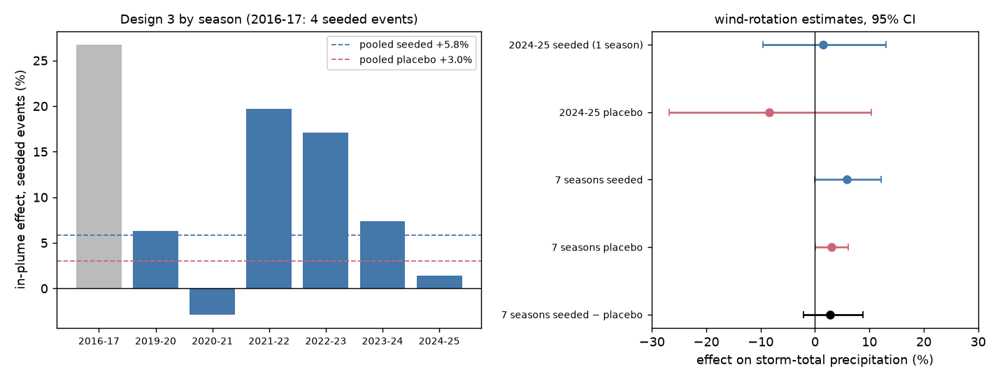
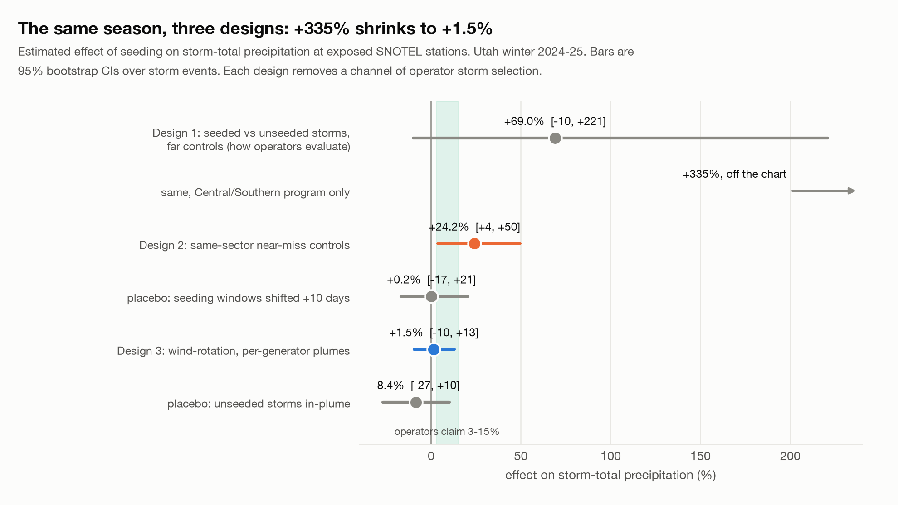
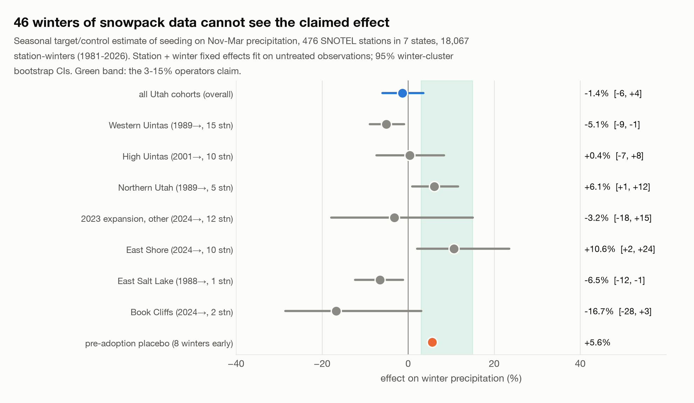
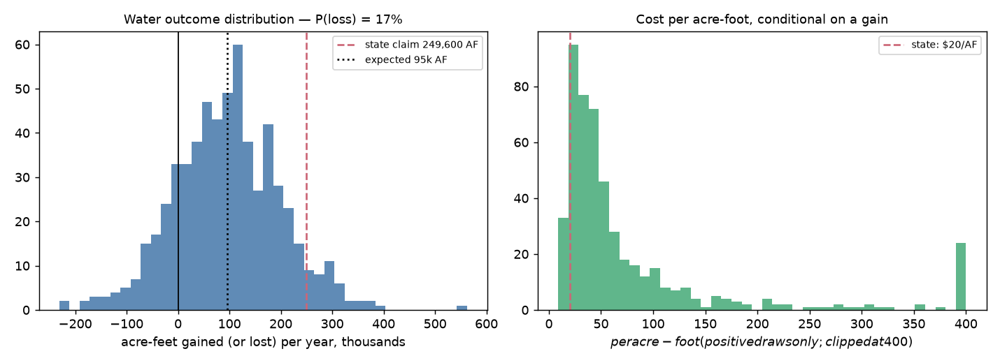
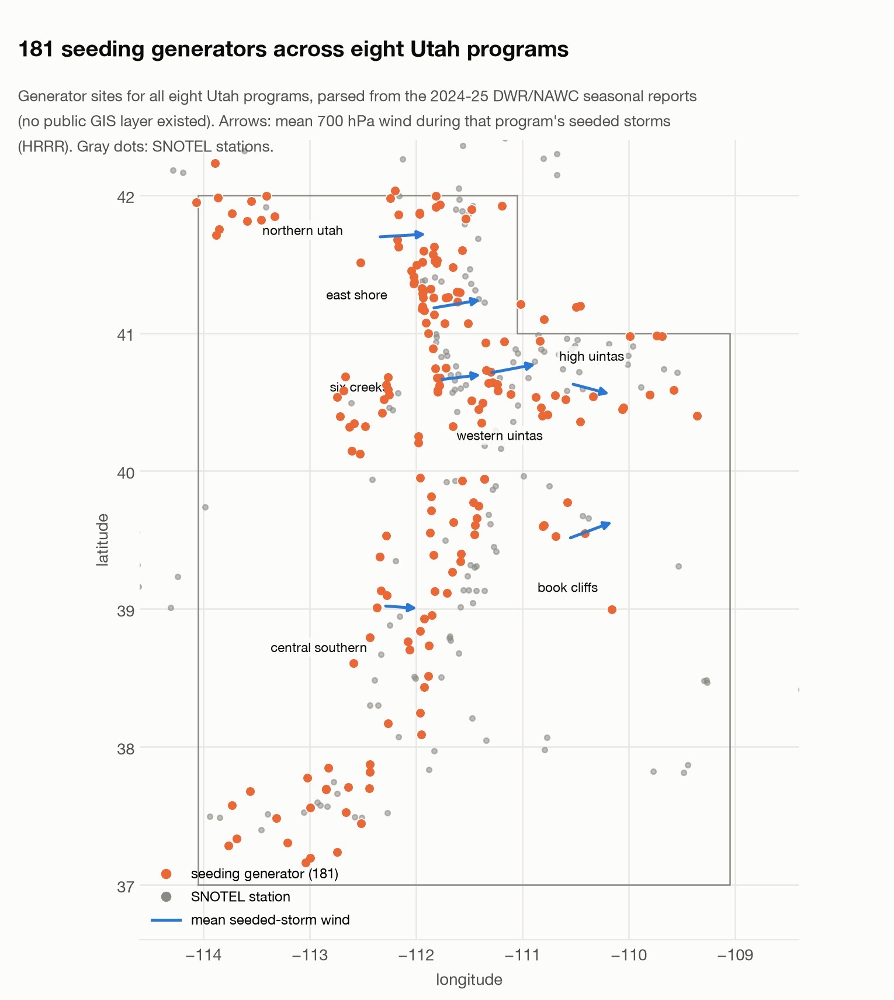

# seeding-verification

Does Utah's cloud seeding program add the 3-15% of winter precipitation it claims? An independent, fully reproducible evaluation built from public data only: the state's own operations reports, NOAA HRRR winds, and USDA SNOTEL gauges. Paper, datasets, code and figures.

Utah runs the largest remotely controlled seeding network in the United States, expanded in 2023 with $12M one-time funding and a $5M annual budget. The evaluations that justify the spend are produced by the contractor that runs the program, using target/control comparisons whose treatment variable is not exogenous: storms are seeded exactly when the wind, moisture and temperature favor the target areas. This repo asks what happens when you take that selection seriously.

📄 Working paper v2 (seven seasons): [paper/seeding-verification-2026.pdf](paper/seeding-verification-2026.pdf)

**Update 2026-09-25 — seven seasons.** The Utah Division of Water Resources shared its earlier seasonal reports. Parsing them gives 525 seeded storm periods over 2016-17 and 2019-20 through 2024-25 (37,773 generator-hours). The wind-rotation design pooled over all seven seasons: **+5.8% [−0.0, +12.1]** in-plume during seeded storms, but the unseeded placebo is now **+3.0% [+0.1, +6.2]** (a wind-aligned orographic gradient the smooth control does not fully absorb), so the placebo-corrected effect is **+2.7% [−2.1, +8.8]** per seeded storm. Consistent with a few percent, consistent with zero, and excluding per-storm effects above ~9%. Per-season estimates and caveats: `data/results/multi-season/`, `FINDINGS` in the paper §Results.





## Two findings

**1. At the seasonal scale, 46 winters of snowpack data cannot see the claimed effect.** A staggered-adoption panel estimator over 476 SNOTEL stations in seven states (46 winters, 1981-2026; station and winter fixed effects fit on untreated observations) gives an overall effect of −1.4% on Nov-Mar precipitation with a 95% CI of [−6.0, +3.6]. The pre-adoption placebo comes in at +5.6%, so the design's noise floor is about ±6%, wider than the lower half of the claimed 3-15% range. Any published seasonal target/control evaluation reporting a significant 5-20% increase from comparable data should be read with that noise floor in mind. (Re-run in September 2026 from a fresh archive pull; see `data/results/seasonal-panel-results.json`.)

**2. At the storm scale, the naive "seeding effect" is almost entirely operator storm selection.** Three designs applied to the same 2024-25 season:

| design | effect on storm-total precip | 95% CI |
|---|---|---|
| 1. Seeded vs unseeded storms, far controls (how programs are evaluated) | +69% pooled, **+335%** for the largest program | [−10, +221] |
| 2. Same-sector near-miss controls | +24.2% | [+3.7, +49.7] |
| — placebo: seeding windows shifted +10 days | +0.2% | [−16.7, +20.7] |
| 3. **Wind-rotation, per-generator plume geometry** (2024-25) | +1.5% | [−9.6, +13.1] |
| — built-in placebo: unseeded storms in-plume | −8.4% | [−26.8, +10.3] |
| 3. **Wind-rotation, seven seasons pooled** | +5.8% | [−0.0, +12.1] |
| — placebo: unseeded storms in-plume | +3.0% | [+0.1, +6.2] |
| — **seeded − placebo** | **+2.7%** | **[−2.1, +8.8]** |

+335% is physically impossible (the gold-standard SNOWIE field experiment puts orographic seeding at single to low double digits), so it is a direct measurement of how much selection bias a conventional evaluation carries at storm scale. The most selection-robust design lands at +1.5% per seeded storm with a clean placebo: consistent with the physical literature, consistent with zero, and excluding per-storm effects above roughly 15-20%. One season cannot separate "works as claimed" from "does nothing"; four to nine seasons of operations records would.




## What the state gets for $5M a year (2026-09-26)

Turning the seven-season estimate into water, as a distribution rather than a number (`COST-ANALYSIS.md`, `src/cost_per_acre_foot.py`):
expected gain ≈ 95k acre-feet a year (about 38% of the state's 249,600 AF claim) at ≈ $52/AF, versus the state's own $20/AF at today's
budget (the ~$1/AF still quoted dates from 2009-10 costs). About one bootstrap draw in six has the program removing water from the target
areas; about two-thirds deliver less than half the claimed volume. Cheap water is plausible; no water is possible; the claim is unsupported.



## Why the wind-rotation design

Silver iodide plumes travel downwind, so which gauges are exposed changes storm by storm with each storm's own wind. Design 3 estimates

```
log(precip)_se = station FE + event FE + smooth wind-alignment score + β1·(in-plume × seeded) + β0·(in-plume × unseeded) + ε
```

where a station is in-plume for event *e* if some generator lies 5-45 km upwind within ±40° of that event's HRRR 700 hPa wind. β0 is a placebo that must be zero (no silver iodide was released). Operators choose *when* to seed, but they cannot rotate a precipitation enhancement around their generators in step with the wind. That is what makes this design resistant to the selection bias that inflates Designs 1 and 2.



## Datasets released

No public GIS layer of Utah's generator network existed. These were parsed from the eight 2024-25 DWR/NAWC seasonal report PDFs (text extracts in `data/reports-2024-25/` for provenance).

| file | contents |
|---|---|
| `data/generators-2024-25.csv` | 181 seeding generator sites with coordinates, all 8 programs (Book Cliffs sites are town-approximate) |
| `data/seeded-storms-2024-25.csv` | 203 seeded storm periods: dates, sites used, generator-hours (17,143 h across 7 ground programs) |
| `data/seeded-storms-multi.csv` | **525 seeded storm periods, 7 seasons** (2016-17, 2019-20…2024-25; NU/WU/SC + all programs 2024-25), parsed by `src/parse_storm_tables_multi.py` from the DWR reports (text in `data/reports-multi/`) |
| `data/results/multi-season/` | per-season event winds, per-event results, and the pooled seven-season wind-rotation estimate (`v23-multi-season-results.json`) |
| `data/storm-winds-2024-25.csv` | mean 700 hPa wind at each program's generator network per seeded storm (HRRR) |
| `data/event-winds-2024-25.csv` | same, for every detected precipitation event including unseeded ones |
| `data/seeding_treatment.json` | per-area seeding timeline 1974-2026 (adoption years, the 1983-87 suspension, gaps) and the neighboring-state programs excluded from controls, with sources in `data/seeding-treatment-map.md` |
| `data/results/` | every estimate as JSON, plus the per-event panel |

## Reproduce

Everything runs on a laptop with [uv](https://docs.astral.sh/uv/). SNOTEL and HRRR pulls hit public APIs and are cached under `data/`.

```
uv sync
uv run python src/parse_generators.py          # report text -> generators-2024-25.csv
uv run python src/fetch_storm_winds.py         # HRRR byte-range GRIB2 -> storm + event winds (needs eccodes; ~30 min first run)
uv run python src/run_storm_analysis.py        # Designs 1-2, placebo, dose-response (~10 min first run: one winter of SNOTEL for 7 states)
uv run python src/v22_plume_rotation.py        # program-centroid rotation test (intermediate design, kept for the record)
uv run python src/v23_per_generator.py         # Design 3 (2024-25)
uv run python src/parse_storm_tables_multi.py  # DWR report text -> seeded-storms-multi.csv (7 seasons)
uv run python src/multi_season.py              # Design 3 pooled over 7 seasons (HRRR winds for ~1,500 hours: run on a VM, see src/vm_multi_season_startup.sh)
uv run python src/run_seasonal_panel.py        # Design 0: 46-winter panel (~45 min first run: full SNOTEL archive for 7 states)
uv run --with matplotlib python src/make_figures.py
```

The paper builds with `cd paper && tectonic main.tex`.

## Limitations, stated plainly

- Storm-level designs now span seven seasons, but earlier seasons cover only 2–3 programs (4–15 seeded events each vs 75 in 2024-25) and use the 2024-25 generator sites. The unseeded placebo is positive at +3%, so the seeding effect is reported as seeded − placebo.
- Wind sectors use each storm's mean 700 hPa flow at the network; hourly shifts within storms are not modeled.
- SNOTEL gauges undercatch snow in wind. This attenuates but does not bias the estimates given fixed effects.
- Book Cliffs generator coordinates are approximate. Seeded/unseeded labels inherit any errors in the operators' storm tables.
- The event catalog is built from precipitation, so completely dry seeded periods are unobservable. This only matters if seeding creates precipitation where none would otherwise fall, which the physical literature does not support at meaningful scale.
- The seasonal panel's treatment map is county-level, so some "treated" stations sit outside real plumes, diluting any true effect toward zero. That is one reason the storm-level designs exist.

## Sources

Utah Division of Water Resources cloud seeding page and 2024-25 seasonal reports (water.utah.gov/cloudseeding). Griffith, Solak and Yorty, "30+ Winter Seasons of Operational Cloud Seeding in Utah," J. Weather Modification 41 (2009). NOAA HRRR on AWS Open Data. USDA NRCS Air and Water Database. French et al. PNAS 2018 and Friedrich et al. PNAS 2020 (SNOWIE). Borusyak, Jaravel and Spiess, Rev. Econ. Stud. 2024 (imputation estimator).

MIT for code. The constructed datasets derive from U.S. public-domain federal data and Utah public records; please cite the working paper if you use them (see [CITATION.cff](CITATION.cff)).
